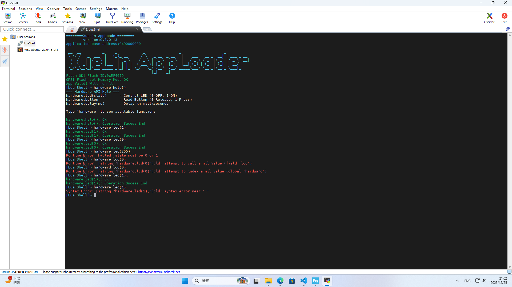

# 运行于FKH750XBH6(32Bits SDRAM)的LUA Shell解释器

## 原理
首先通过USART1接收命令行字节并匹配Terminal的行编辑模式并实时回显，然后在接收到方向键时移动光标或者翻历史记录(最高10条，要增减自己改MAX_HISTORY定义)

然后在接收到回车符号("\r"或"\n")后，将字符串指针通过队列送到LUA_ProcessTask_Handle，通过xQueueReceive把指针拷出来，此时指向的就是接收到的指令字符串数据，用完free

之后就是在接收到指令时，调用LUA解释器，执行指令

最后，就是错误处理，把出现的所有错误给接下来，语法和执行错误别把RTOS打崩了就行

## 许可证

本项目采用**双许可证**模式：

- **个人/非商业使用**：遵循 [GPLv3 许可证](License.txt)
- **商业使用**：需获取商业授权，请联系 [xuelin-sherlyn@outlook.com](mailto:xuelin-sherlyn@outlook.com)

简单说：个人、学习、研究随便用；公司商用请先联系我获取授权。